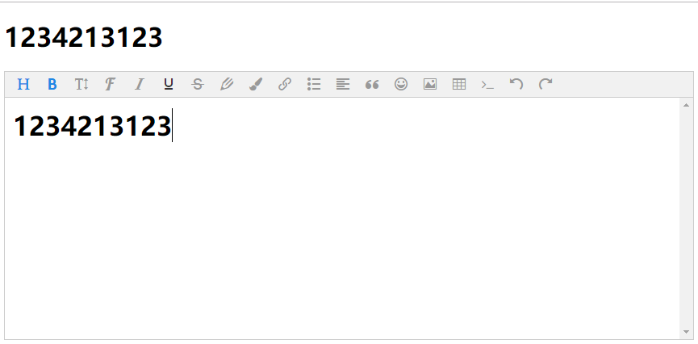
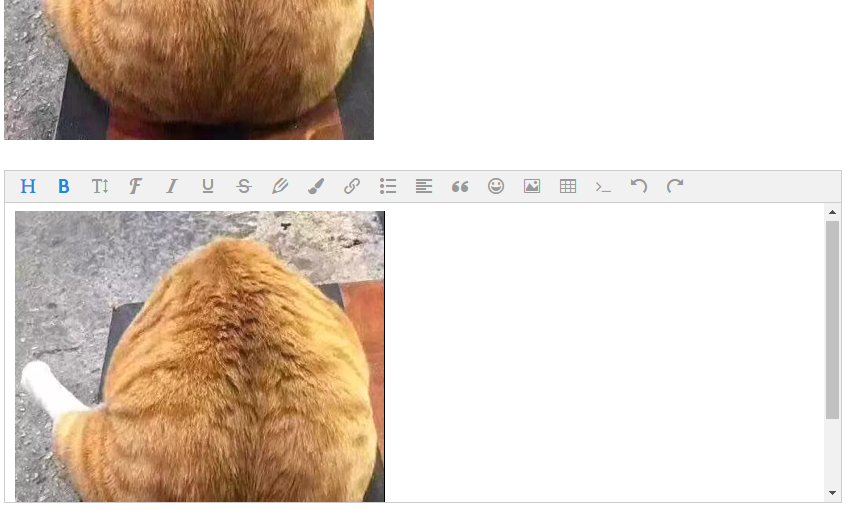

### vue-editor-interline

> `Vue`富文本框插件 by Jdes

该插件是基于`jsy-editor`富文本插件进行二次封装的`Vue`版本的富文本插件，保留全部功能，同时简化常规配置（主要是图片上传配置优化）

> [jsy-editor](https://github.com/JdesEva/jsy-editor) 富文本插件是在 [wangEditor](https://github.com/wangfupeng1988/wangEditor) 的基础上进行功能扩展之后的富文本框插件

> 插件部分配置和`wangEditor`权值不一样，请勿随意重复配置。

> 重要说明： 使用该富文本框插件，在提交表单之后，务必进行**重置操作**，即将`v-model`的值设置为空字符串

### API

| props      | default            | type      | 说明                                                                                         |
| ---------- | ------------------ | --------- | -------------------------------------------------------------------------------------------- |
| `v-model`  | -                  | -         | 绑定值，双向绑定                                                                             |
| `toolBar`  | 同`wangEditor`菜单 | `Array`   | 富文本框工具栏，默认值和`wangEditor`一样                                                     |
| `action`   | `''`               | `String`  | 图片上传地址                                                                                 |
| `fileName` | `files`            | `String`  | 服务器图片上传接口文件流键名                                                                 |
| `baseUrl`  | `''`               | `String`  | 图片上传回显的前缀地址，默认空                                                               |
| `size`     | 2                  | `Number`  | 图片上传大小限制，单位:MB                                                                    |
| `limit`    | -                  | `Number`  | 图片上传数量限制，默认无                                                                     |
| `data`     | `{}`               | `Object`  | 图片上传附加参数                                                                             |
| `merge`    | `false`            | `Boolean` | 图片上传参数是否合并到 url                                                                   |
| `debug`    | `false`            | `Boolean` | 富文本框`debugger`模式开关，生产环境建议关闭                                                 |
| `hook`     | `{}`               | `Object`  | 自定义图片上传钩子函数，配置此项必须覆写`customInsert`钩子                                   |
| `option`   | `{}`               | `Object`  | `wangEditor`富文本框配置，**权值最高**，配置此项后，会覆盖之前单独配置的同名配置，请谨慎使用 |

> 注意，以上图片上传相关配置（`fileName`,`baseUrl`,`merge`,`data`），必须在开启服务器上传配置`action`后才会生效。

> 富文本默认上传方式（即不配置`action`）为`base64`。

### 安装

```shell
yarn add vue-editor-interline --save
```

或者

```shell
npm i vue-editor-interline --save
```

### `main.js`

```js
import vueEditor from 'vue-editor-interline'
import 'vue-editor-interline/lib/vue-editor-interline.css'

Vue.use(vueEditor)
```

### 模板语法

```html
<template>
  <div id="app">
    <div>
      <vueEditor
        debug
        v-model="data"
        :option="{fontNames : [
            '宋体',
            '隶书',
            '微软雅黑',
            'Arial',
            'Tahoma',
            'Verdana'
        ]}"
      />
    </div>
  </div>
</template>
```

### 示例

#### 文本模式



#### 图片


